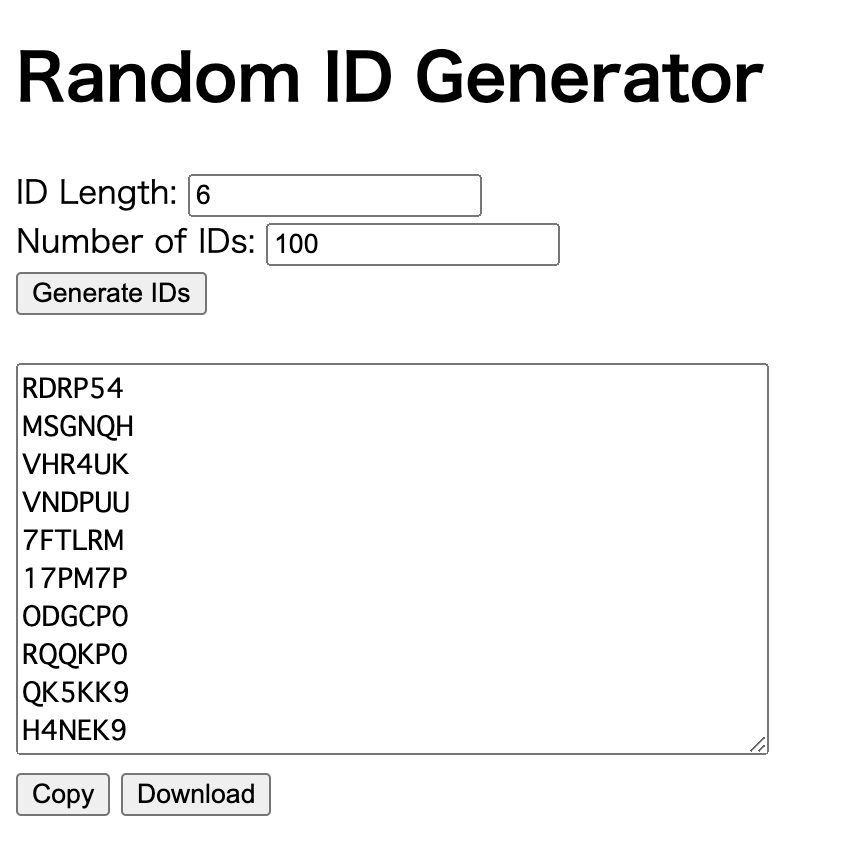
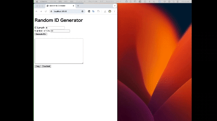

# ID generator




## Demo




## How to use on your local machine

1. Run the following:

```bash
docker run --rm -d -p 5000:5000 random-id-generator
```

2. Access http://localhost:5000/ on your web browser


### Note

If your web browser shows ERR_UNSAFE_PORT error, your should

- `docker run --rm -d -p 8080:5000 random-id-generator`


## How to use on a remote server

1. Run the following on a remote server:

```bash
docker run --rm -d -p 5000:5000 random-id-generator
```

2. Run the following on your local machine (SSH port forwarding):

```
ssh -L 8080:localhost:5000 <user_id@remote_ip>
```

2. Access http://localhost:8080/ on your web browser

